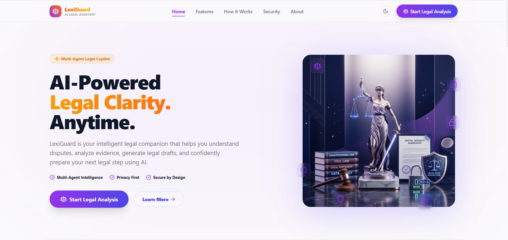
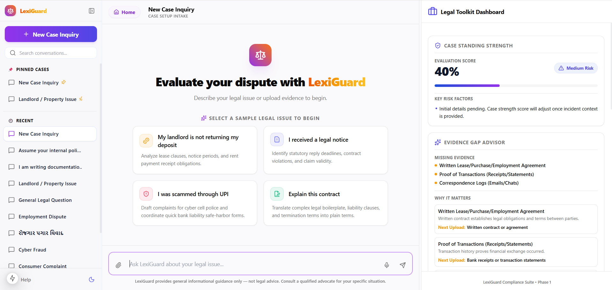
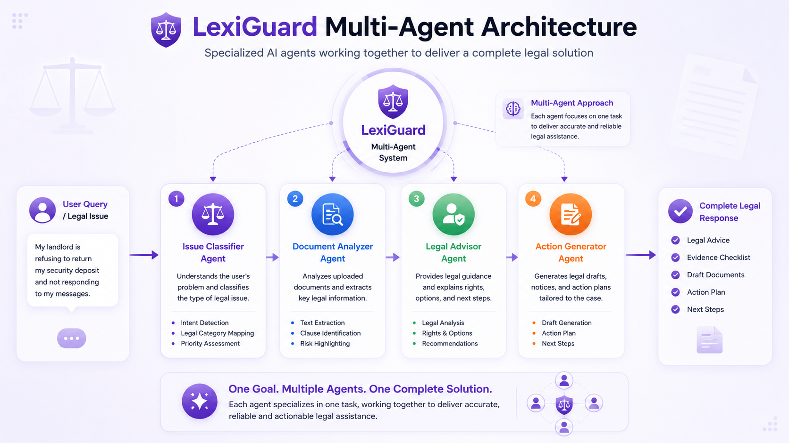
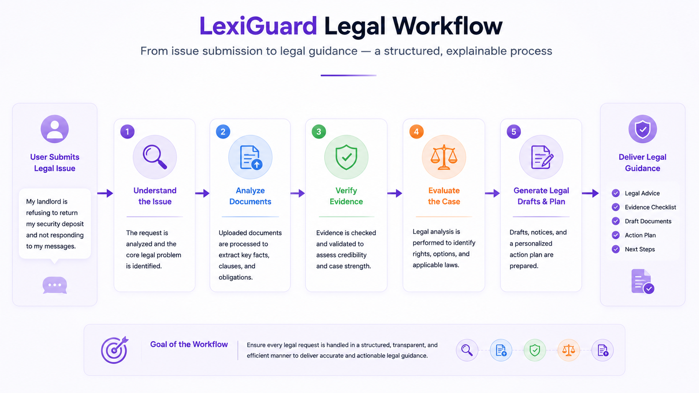
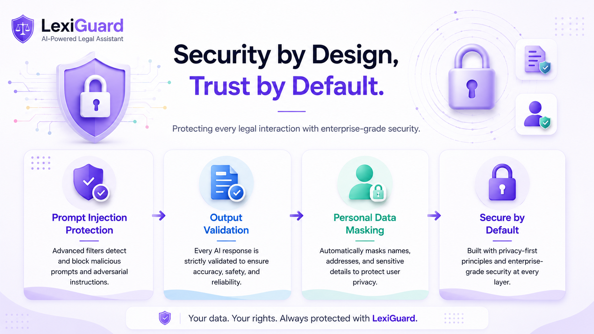

<p align="center">

# ⚖️ LexiGuard

### Secure Multi-Agent AI Legal Assistant

Empowering citizens with AI-driven legal guidance through a secure, intelligent, and user-friendly platform.

</p>


<br>

---

# 🎬 Project Demo

### 🎥 **Demo Video**

[Watch on YouTube](https://youtu.be/VtlNR6rMPrU)

<br>


# 🌍 Overview

Legal systems are often difficult to understand for ordinary citizens. Complex terminology, scattered procedures, and expensive legal consultations discourage people from seeking timely legal help.

**LexiGuard** bridges this gap using a secure Multi-Agent AI architecture powered by **Google Gemini** and **Google ADK**. Instead of acting as a generic chatbot, LexiGuard intelligently coordinates multiple specialized AI agents that analyze legal issues, simplify legal documents, estimate case strength, generate personalized action plans, verify evidence, and prepare legal drafts.

The platform is designed to make legal guidance **simple, secure, accessible, and actionable** while maintaining transparency and user privacy.

<br>

---

# 🎯 Problem Statement

Millions of people struggle to understand legal documents and procedures.

Common challenges include:

- 📄 Complex legal language
- ⚖️ Lack of affordable legal guidance
- ⏳ Time-consuming legal processes
- 📑 Difficulty identifying required evidence
- 🧭 Uncertainty about the next legal steps
- 👩‍⚖️ Limited access to professional legal assistance

For many first-time users, navigating legal systems becomes overwhelming before they even know where to begin.

<br>

---

# 💡 Our Solution

LexiGuard transforms complicated legal workflows into a guided AI-assisted experience.

Instead of searching through lengthy legal documents or confusing online resources, users simply describe their problem or upload relevant documents.

A team of specialized AI agents then collaborates behind the scenes to:

- Understand the legal issue
- Analyze uploaded documents
- Simplify legal terminology
- Evaluate case strength
- Suggest required evidence
- Generate legal drafts
- Build a personalized action plan

All of this happens through a clean and intuitive Conversational AI interface.

<br>

---

# ✨ Key Features

| Feature | Description |
|----------|-------------|
| ⚖️ Issue Classification | Automatically identifies the legal category of the user's issue. |
| 📄 Document Simplifier | Converts complex legal language into easy-to-understand explanations. |
| 📊 Case Strength Analysis | Estimates the strength of the case based on available information. |
| 🧾 Evidence Checklist | Identifies available evidence and highlights missing documents. |
| 🗂 Personalized Action Plan | Generates clear step-by-step legal guidance. |
| ✍ Legal Draft Generation | Creates legal drafts such as demand notices and complaint letters. |
| 🤖 Multi-Agent Collaboration | Specialized AI agents coordinate to solve legal problems. |
| 🔒 Security Layer | Prompt injection detection, input validation, and secure output masking. |
| 🔌 MCP Integration | Exposes legal capabilities through a standalone Model Context Protocol server. |

<br>

---

# 🖼 Product Preview


<p align="center">
  
</p>

<br>

> **LexiGuard Landing Page** — A modern SaaS-style interface introducing the platform, its workflow, security philosophy, and key capabilities before entering the AI workspace.

<br>

---

<p align="center">
 

</p>

<br>

> **AI Workspace** — A GPT-style interface where users interact with multiple AI agents to analyze legal problems, upload documents, receive case insights, generate action plans, and prepare legal drafts.

<br>

# 🚀 Why LexiGuard?

Unlike traditional legal chatbots, LexiGuard follows a **Multi-Agent AI architecture**.

Each agent performs a specialized task, allowing the platform to deliver structured, context-aware, and reliable legal assistance.

This architecture improves:

- Accuracy
- Maintainability
- Transparency
- Security
- Scalability

while keeping the user experience simple and intuitive.

---

> **"Legal guidance should be accessible to everyone—not just those who can afford it."**

---

# 🛠 Technology Stack

| Category | Technology |
|-----------|------------|
| Frontend | Next.js 15 |
| Language | TypeScript |
| Styling | Tailwind CSS |
| AI Model | Google Gemini 2.5 Flash |
| Multi-Agent Framework | Google Agent Development Kit (ADK) |
| Protocol | Model Context Protocol (MCP) |
| Icons | Lucide React |
| Markdown Rendering | React Markdown |

<br>
---

# 🤖 Specialized AI Agents

LexiGuard follows a Multi-Agent architecture where each AI agent performs a dedicated responsibility before contributing to the final legal response.

| Agent | Responsibility |
|--------|----------------|
| ⚖️ Issue Classifier Agent | Identifies the legal domain and routes the request to the appropriate reasoning workflow. |
| 📄 Document Analyzer Agent | Analyzes uploaded legal documents, extracts clauses, obligations, entities, and simplifies legal language. |
| 👨‍⚖️ Legal Advisor Agent | Explains legal rights, evaluates the user's situation, and provides personalized legal guidance. |
| 📝 Action Generator Agent | Generates legal drafts, evidence checklists, timelines, and actionable next steps tailored to the case. |

Together, these specialized agents collaborate through **Google ADK** and **Google Gemini** to deliver structured, explainable, and context-aware legal assistance.

<br>


# 🏗️ System Architecture

<p align="center">
  
</p>

LexiGuard follows a **Multi-Agent AI Architecture**, where multiple specialized AI agents collaborate to solve a user's legal problem. Instead of relying on a single AI model, each agent is responsible for a dedicated task, resulting in more accurate, modular, and explainable responses.

Google **Gemini** serves as the reasoning engine, while **Google Agent Development Kit (ADK)** orchestrates the communication between the agents.

    

<br>

# 🔄 User Workflow

<p align="center">
  
</p>

LexiGuard transforms complex legal processes into a simple guided workflow.

<br>

# 🔌 Model Context Protocol (MCP)

LexiGuard exposes its legal intelligence through a lightweight standalone **Model Context Protocol (MCP)** server.

This allows external AI clients to securely access LexiGuard's legal capabilities without interacting directly with the web application.

Implemented MCP tools:

- classify_legal_issue
- analyze_document
- generate_legal_advice
- generate_action_plan
- generate_draft_document
- detect_evidence

Every MCP request passes through the same security layer used by the web application.

---

# ⚡ Why MCP?

Using MCP provides several advantages:

- Standardized AI tool interface
- Secure external integrations
- Better interoperability
- Modular architecture
- Future extensibility

The web application and external MCP clients both consume the same underlying legal services, ensuring consistent behavior across platforms.

---

# 🔒 Security by Design

<p align="center">
  
</p>

Security is a core design principle of LexiGuard. Every legal query passes through multiple protection layers before AI processing, ensuring safe, reliable, and privacy-focused interactions.
<br>

### Security Highlights

- 🛡 Prompt Injection Protection
- 🔍 Jailbreak Detection
- ✅ Input & Output Validation
- 📄 Secure Document Processing
- 🧹 Document Sanitization
- 🔒 Personally Identifiable Information (PII) Masking
- ⚖️ Safe Prompt Routing
- 🔐 Privacy-First Architecture

> **LexiGuard does not permanently store user conversations or uploaded legal documents. All processing is designed with privacy and security as core principles.**

<br>

# 🧪 Validation & Testing

To improve reliability, LexiGuard was validated through comprehensive end-to-end testing across multiple legal domains.

### Validation Highlights

- ✅ 95 automated verification scenarios passed
- ✅ End-to-end workflow validation
- ✅ Multi-agent orchestration testing
- ✅ Entity resolution verification
- ✅ Timeline consistency validation
- ✅ Draft generation validation
- ✅ Randomized stress testing
- ✅ Production build verification

These validation checks help ensure accurate legal reasoning, consistent entity mapping, reliable draft generation, and stable multi-agent orchestration.

---

# 📂 Project Structure

```text
LexiGuard/
│
├── app/                 # Next.js App Router pages
├── agents/              # AI Agent implementations
│   ├── issue-classifier.ts
│   ├── document-analyzer.ts
│   ├── legal-advisor.ts
│   └── action-generator.ts
│
├── components/          # Reusable UI components
├── hooks/               # Custom React hooks
├── lib/                 # Utility functions
├── services/            # AI and application services
├── scripts/             # Project scripts
├── types/               # TypeScript type definitions
├── docs/                # Project documentation
├── public/              # Static assets
├── Assets/              # README images & screenshots
├── temp_uploads/        # Temporary uploaded files
│
├── .env.local           # Environment variables
├── package.json
├── next.config.ts
├── tsconfig.json
└── README.md
```

---

# ⚙️ Installation

Clone the repository:

```bash
git clone https://github.com/SejalPatel01/LexiGuard.git
```

Move into the project directory:

```bash
cd LexiGuard
```

Install dependencies:

```bash
npm install
```

Create a `.env.local` file:

```env
GEMINI_API_KEY=YOUR_API_KEY
```

Run the development server:

```bash
npm run dev
```

Open:

```
http://localhost:3000
```

---

# 🎯 Use Cases

LexiGuard is designed to assist users across a wide range of legal scenarios.


| User | Example |
|------|---------|
| 🏠 Tenant | Rental disputes & security deposits |
| 👨‍💼 Employee | Workplace conflicts & salary issues |
| 🛒 Consumer | Fraud, defective products & complaints |
| 👨‍👩‍👧 Family | Property and family-related disputes |
| 🎓 Student | Rental agreements & legal documentation |
| 👤 General Citizen | Legal notices, contracts & everyday legal guidance |

---

# 🚀 Future Roadmap

Although LexiGuard already provides a complete legal assistance workflow, future enhancements may include:

- 🌍 Support for additional regional and jurisdiction-specific legal frameworks.
- 🧠 Enhanced legal reasoning with citation-backed responses.
- 🌐 Expanded multilingual support for wider accessibility.
- 🤝 Integration with government legal service portals and public legal resources.
- 📂 Secure encrypted cloud storage for user-managed legal documents.
<br>


# 🏆 Built as the Capstone Project for the Google × Kaggle AI Agents Intensive Course 

LexiGuard is a **Multi-Agent AI Legal Assistant** developed as the capstone project following the **Google Kaggle 5-Day Gen AI Intensive Course**, and built for the **Google × Kaggle AI Agents Capstone**.

Powered by **Google Gemini**, **Google Agent Development Kit (ADK)**, and **Model Context Protocol (MCP)**, LexiGuard demonstrates how specialized AI agents can collaborate to deliver secure, explainable, and actionable legal assistance through a modern, real-world architecture.
<br>

---

## 🧑‍🎓 Author

Made with 💻 by **Sejal Patel**

---

<p align="center">

## ⚖️ LexiGuard

### *Legal Clarity. Powered by AI.*

Built with ❤️ using **Google Gemini**, **Google ADK**, and **Next.js**

⭐ If you found this project useful, consider giving it a **Star** on GitHub!

</p>
