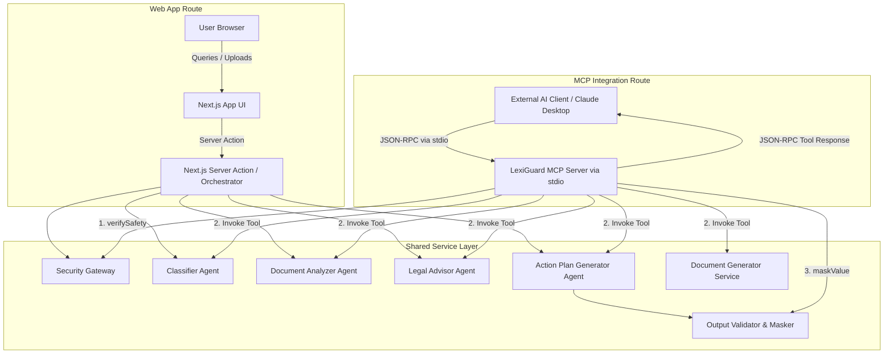

# LexiGuard MCP Server Architecture

This document describes the integration of the Model Context Protocol (MCP) server into LexiGuard.

## What is MCP?

The **Model Context Protocol (MCP)** is an open standard protocol created to connect AI clients (such as Claude Desktop, Cursor, or general LLM agents) to data sources and tool capabilities. It operates similarly to development protocols like LSP (Language Server Protocol), defining a standard structure for:
* **Resources:** Files, DB contents, or text schemas the model can read.
* **Tools:** Functions the model can invoke to take action or get processed data.
* **Prompts:** Reusable prompt templates.

## Why LexiGuard Exposes MCP Tools

LexiGuard is a robust, multi-agent legal assistance application. By exposing our legal reasoning modules as MCP tools, we allow **external LLMs and developer environments** to use LexiGuard's advanced legal engines directly. For example:
1. A developer writing an application can use the LexiGuard MCP server in Cursor/Claude Desktop to draft contracts, analyze clause liabilities, or check evidence compliance.
2. Other systems can programmatically consume LexiGuard's tools as microservices.

---

## Architectural Workflow

The MCP server is implemented as a **completely decoupled, independent interface gateway**. The current Next.js application behaves exactly as it did before. The two access paths to the services are illustrated below:



---

## Registered MCP Tools

LexiGuard registers **6 core tools** over the stdio transport:

### 1. `classify_legal_issue`
Classifies a raw user query into one of our core legal categories.
* **Input Schema:** `{ userQuery: string }`
* **Output Fields:** `{ category: string, confidence: number, reasoning: string, requiresDocumentAnalysis: boolean }`

### 2. `analyze_document`
Performs a clause-by-clause breakdown and extracts liabilities/deadlines from pasted legal text.
* **Input Schema:** `{ documentText: string, language?: "en" | "hi" | "gu" }`
* **Output Fields:** `{ summary: string, clauses: Array, obligations: string[], deadlines: Array, risks: string[] }`

### 3. `generate_legal_advice`
Generates structured legal advice based on the dispute category and optional contract context.
* **Input Schema:** `{ query: string, category: string, analysis?: string, language?: "en" | "hi" | "gu" }`
* **Output Fields:** `{ rights: string[], actions: string[], notes: string[], advice: string }`

### 4. `generate_action_plan`
Compiles evidence checklists, cited provisions, timeline events, and formal draft document templates.
* **Input Schema:** `{ query: string, category: string, adviceContext: string, analysisContext?: string, detectedDocType?: string, language?: "en" | "hi" | "gu" }`
* **Output Fields:** `{ timeline: Array, checklist: string[], laws: string[], risks: string[], drafts: Array }`

### 5. `generate_draft_document`
Drafts a customizable legal notice or complaint form template based on facts and headers.
* **Input Schema:** `{ documentType: string, facts: string }`
* **Output Fields:** `{ title: string, type: string, previewText: string }`

### 6. `detect_evidence`
Verifies which evidence checklist items are satisfied by an uploaded document's text.
* **Input Schema:** `{ documentText: string, checklist: string[] }`
* **Output Fields:** `{ verified_evidence: string[], missing_evidence: string[] }`

---

## Example Tool Call

An external client sends a JSON-RPC request to invoke `classify_legal_issue`:

### Request
```json
{
  "jsonrpc": "2.0",
  "method": "tools/call",
  "params": {
    "name": "classify_legal_issue",
    "arguments": {
      "userQuery": "I was terminated from my developer job without receiving my final month salary."
    }
  },
  "id": 1
}
```

### Response
```json
{
  "jsonrpc": "2.0",
  "result": {
    "content": [
      {
        "type": "text",
        "text": "{\n  \"category\": \"Employment Dispute\",\n  \"confidence\": 95,\n  \"reasoning\": \"Rule-based detection matched keyword(s) [salary] associated with Employment Dispute.\",\n  \"requiresDocumentAnalysis\": false\n}"
      }
    ]
  },
  "id": 1
}
```

---

## Security Integration

The MCP server behaves exactly like a primary user-facing API client. It integrates all core security guardrails:
1. **Input Security Check:** Every user input or document text is passed through the `checkPromptSecurity()` gateway before any downstream tools or Gemini API calls are made. Prompt injections or jailbreaks are immediately blocked and return a standard security error block.
2. **Output PII Masking:** All returned tool payload objects are serialized and passed through `validateAndMaskOutput()` to redact Aadhaar numbers, PAN cards, phone numbers, email addresses, and key developer credentials before transmission back to the client.
